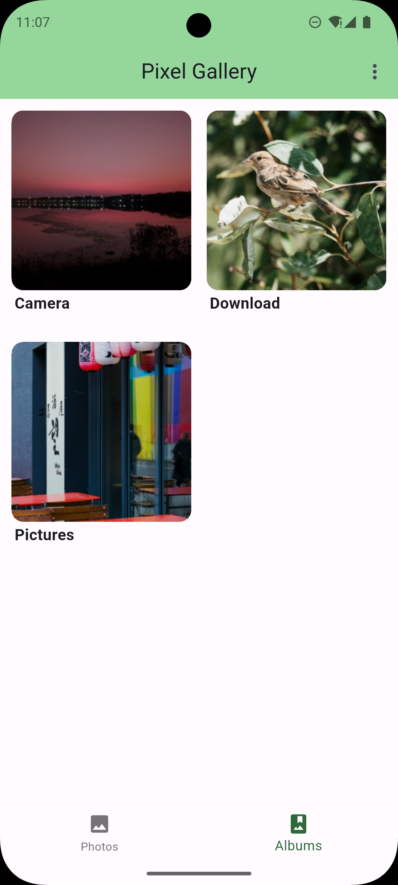
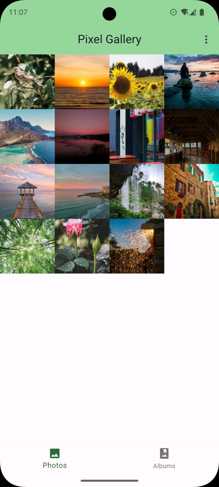
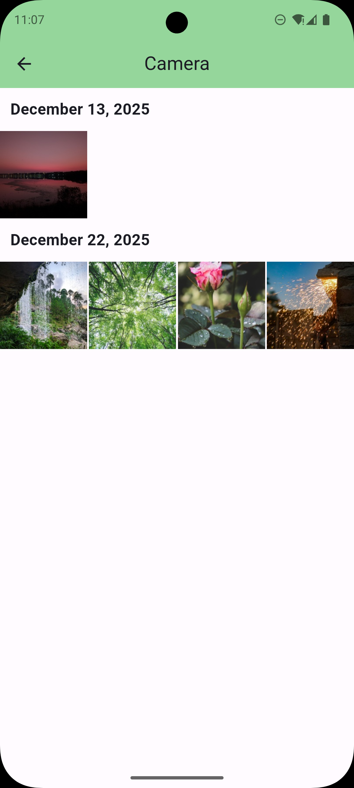
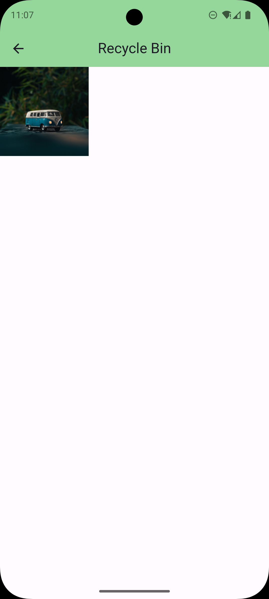
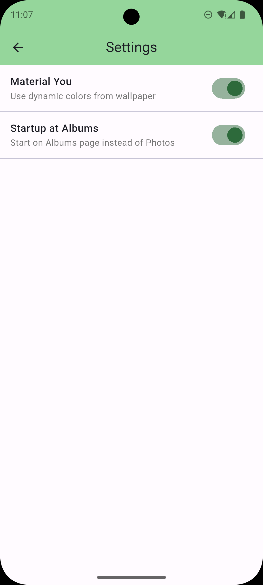

# Pixel Gallery

<p align="center">
  
</p>

<p align="center">
  <b>A modern, open-source gallery app built for Android with Flutter.</b>
</p>

<p align="center">
  <a href="https://flutter.dev">
    
  </a>
  <a href="https://dart.dev">
    
  </a>
  <a href="https://github.com/bkk31">
    
  </a>
</p>

<p align="center">
  <a href="#features">Features</a> •
  <a href="#screenshots">Screenshots</a> •
  <a href="#installation">Installation</a> •
  <a href="#tech-stack">Tech Stack</a> •
  <a href="#contributing">Contributing</a> •
  <a href="#license">License</a>
</p>

---

## 📖 About

**Pixel Gallery** is a sleek, privacy-focused gallery application designed to provide a premium user experience. It leverages the power of **Material You** dynamic theming to adapt to your device's wallpaper, ensuring a seamless and personalized look. From managing your photo albums to viewing motion photos and map locations, Pixel Gallery creates a beautiful home for your memories.

> [!NOTE]
> This app implements a **Material 3 Expressive** aesthetic using community-developed packages. As official support for Material 3 Expressive is not yet provided by the Flutter team, the implementation relies on custom and community components which may differ slightly from the official specifications.

## ✨ Features

- **🎨 Material You Design** - Fully adapts to your device's system colors (Android 12+).
- **📂 Smart Organization** - Automatically categorizes your media into Albums, Recents, and Videos.
- **🗑️ Recycle Bin** - Safely recover deleted photos and videos or permanently remove them.
- **🎞️ Motion Photos** - Detects and plays the video component of Motion Photos (Live Photos).
- **📍 Location Map** - View exactly where your photos were taken on an interactive OpenStreetMap.
- **📷 EXIF Details** - View detailed camera metadata (Model, Aperture, ISO, Shutter Speed).
- **⚡ Fast & Responsive** - Built with performance in mind using Flutter's rendering engine.
- **🔒 Privacy First** - Your photos stay on your device. No cloud uploads, no tracking.

## 📱 Screenshots

|                              Home Screen                              |                               Photos Screen                               |                               Albums                               |
| :-------------------------------------------------------------------: | :-----------------------------------------------------------------------: | :----------------------------------------------------------------: |
|  |  |  |

|                               Viewer Screen                               |                                 Recycle Bin                                  |                                Settings                                |
| :-----------------------------------------------------------------------: | :--------------------------------------------------------------------------: | :--------------------------------------------------------------------: |
|  |  |  |

## 📸 Credits

Sample photos used in screenshots are by the following authors on Unsplash:

- [Ispywithmylittleeye](https://unsplash.com/@ispywithmylittleeye)
- [Khouser01](https://unsplash.com/@khouser01)
- [Teodor Drobota](https://unsplash.com/@teodordrobota)
- [Wulcan](https://unsplash.com/@wulcan)
- [Sardar Kamran](https://unsplash.com/@sardarkamran128)
- [Fermin Rodriguez Penelas](https://unsplash.com/@ferminrp)
- [Ivan Diaz](https://unsplash.com/@ivvndiaz)
- [Gilley Aguilar](https://unsplash.com/@gilleyaguilar)
- [NordWood Themes](https://unsplash.com/@nl_lehmann)
- [Studio Mike Franca](https://unsplash.com/@studiomikefranca)
- [Chandu 029](https://unsplash.com/@chandu029)
- [Hanna Plants](https://unsplash.com/@hanna_plants)
- [Joshua Kettle](https://unsplash.com/@joshuakettle)

Icons generated using [icon.kitchen](https://icon.kitchen)

## 🛠 Installation

To run Pixel Gallery locally, you'll need [Flutter](https://flutter.dev/docs/get-started/install) installed.

1.  **Clone the repository:**

    ```bash
    git clone https://github.com/bkk31/pixel-gallery.git
    cd pixel-gallery
    ```

2.  **Install dependencies:**

    ```bash
    flutter pub get
    ```

3.  **Run the app:**
    ```bash
    flutter run
    ```

## 🏗 Tech Stack

Pixel Gallery is built with a curated list of top-tier libraries:

- [**Flutter**](https://flutter.dev) - UI Toolkit.
- [**shared_preferences**](https://pub.dev/packages/shared_preferences) - Read and write simple key-value pairs.
- [**intl**](https://pub.dev/packages/intl) - Internationalization and localization.
- [**sqflite**](https://pub.dev/packages/sqflite) - SQLite plugin for Flutter.
- [**path**](https://pub.dev/packages/path) - Path manipulation library.
- [**flutter_local_notifications**](https://pub.dev/packages/flutter_local_notifications) - Displaying local notifications.
- [**dynamic_color**](https://pub.dev/packages/dynamic_color) - Material You dynamic theming.
- [**share_plus**](https://pub.dev/packages/share_plus) - Native sharing capabilities.
- [**photo_view**](https://pub.dev/packages/photo_view) - Zoomable image viewer.
- [**video_player**](https://pub.dev/packages/video_player) - Video playback support.
- [**motion_photos**](https://pub.dev/packages/motion_photos) - Motion photo extracting.
- [**flutter_map**](https://pub.dev/packages/flutter_map) + [**latlong2**](https://pub.dev/packages/latlong2) - OpenStreetMap integration.
- [**native_exif**](https://pub.dev/packages/native_exif) - Efficient EXIF metadata reading.
- [**cupertino_icons**](https://pub.dev/packages/cupertino_icons) - iOS-style icons.
- [**path_provider**](https://pub.dev/packages/path_provider) - Local file system access.
- [**permission_handler**](https://pub.dev/packages/permission_handler) - Cross-platform permission handling.
- [**device_info_plus**](https://pub.dev/packages/device_info_plus) - Device version checking.
- [**m3e_collection**](https://pub.dev/packages/m3e_collection) - Material 3 Expressive components.
- [**flutter_floating_bottom_bar**](https://pub.dev/packages/flutter_floating_bottom_bar) - Interactive floating navigation.
- [**url_launcher**](https://pub.dev/packages/url_launcher) - Opening external links.
- [**font_awesome_flutter**](https://pub.dev/packages/font_awesome_flutter) - Font Awesome icons.
- [**streams_channel**](https://github.com/deckerst/aves_streams_channel) - Aves streams channel.
- [**wallpaper_manager_plus**](https://pub.dev/packages/wallpaper_manager_plus) - Set device wallpaper.
- [**wakelock_plus**](https://pub.dev/packages/wakelock_plus) - Keep the device screen awake.

## 🤝 Contributing

Contributions are welcome! If you have suggestions or want to report a bug, please open an issue or submit a pull request.

1.  Fork the repository.
2.  Create your feature branch (`git checkout -b feature/amazing-feature`).
3.  Commit your changes (`git commit -m 'Add some amazing feature'`).
4.  Push to the branch (`git push origin feature/amazing-feature`).
5.  Open a Pull Request.

## 🙏 Acknowledgements

A significant portion of the backend logic, particularly for media handling and metadata extraction, is adapted from the [Aves](https://github.com/deckerst/aves) project. Aves is a beautiful and feature-rich gallery and metadata explorer for Android, and its source code was invaluable to the development of Lumina Gallery. The `streams_channel` package used in this project is also a part of the Aves project.

The original Aves project is licensed under the [BSD 3-Clause "New" or "Revised" License](https://github.com/deckerst/aves/blob/main/LICENSE). We are immensely grateful to the Aves contributors for their work.

## 📄 License

Distributed under the GNU Public License GPL-3. See `LICENSE` for more information.
